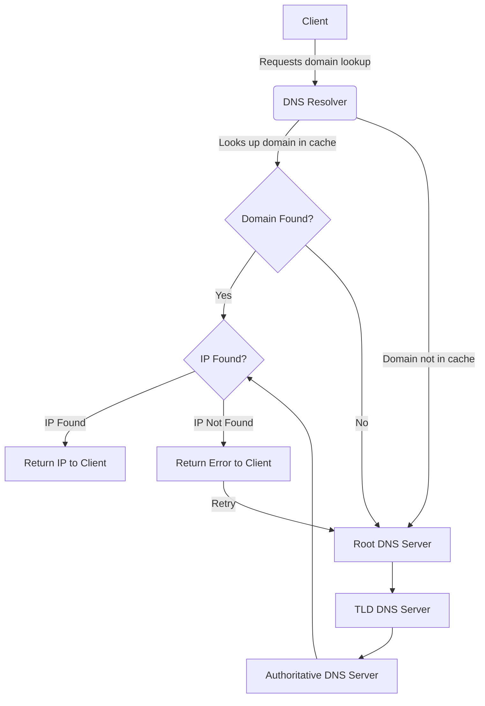

# Networks

### URL (Uniform Resource Locator) consists of several components:

- **Protocol**: Specifies the protocol used to access the resource (e.g., `http://`, `https://`, `ftp://`).
- **Domain**: Identifies the location of the resource on the internet (e.g., `example.com`, `subdomain.example.com`).
- **Additional Path**: Optional path to a specific resource on the server (e.g., `/path/to/resource`).
- **Query Parameters**: Additional parameters passed to the server for processing (e.g., `?key1=value1&key2=value2`).
- **Fragment**: Identifies a specific section within the resource (e.g., `#section`).

Example URL: `https://www.example.com/path/to/resource?key1=value1&key2=value2#section`

### Domain
A domain is a broader concept representing the human-readable address of a website. It serves as part of the URL, facilitating the navigation and identification of resources on the internet. Domains are organized hierarchically, typically consisting of multiple levels separated by dots.

#### Key Points:
- **Human-Readable Address**: Domains are designed to be easily understood by humans, providing a meaningful representation of the website's identity or purpose.
- **Hierarchical Structure**: Domains follow a hierarchical structure, with the top-level domain (TLD) at the highest level, followed by subdomains and additional levels if applicable.
- **Identifies Specific Websites**: Each domain uniquely identifies a specific website or group of related resources on the internet.
- **Managed by Domain Name System (DNS)**: The Domain Name System (DNS) translates domain names into numerical IP addresses, facilitating the routing of internet traffic.

#### Components of a Domain:

- **Top-Level Domain (TLD)**: The highest level in the domain hierarchy, indicating the type or purpose of the website (e.g., `.com`, `.org`, `.net`).
- **Second-Level Domain (SLD)**: Directly below the TLD, typically representing the organization, business, or entity associated with the website (e.g., `example` in `example.com`).
- **Subdomain**: Optionally, additional levels can be added to the domain hierarchy to organize and categorize specific sections or services within a website (e.g., `blog.example.com`, `shop.example.com`).

#### Example:
Consider the URL `https://www.example.com`:
- `example.com` is the domain name.
- `.com` is the top-level domain (TLD).
- `example` is the second-level domain (SLD).
- `www` is a subdomain, commonly used to denote the World Wide Web.

### DNS (Domain Name System)
The Domain Name System (DNS) is a hierarchal and distributed naming system that translates human-readable domain names into IP Addresses. This translation enables users to access websites and other online resources using easily memorable names instead of numerical IP Addresses.

#### Key Points:
- **Hierarchical Structure**: DNS organizes domain names in a hierarchical structure, facilitating efficient resolution and management of domain names.
- **Translation**: DNS translates domain names to IP addresses and vice versa, enabling seamless communication between devices on the internet.
- **Distribution**: DNS operates in a distributed manner, with multiple DNS servers responsible for different parts of the domain namespace.
- **Caching**: DNS servers cache resolved domain name records to improve performance and reduce the load on the DNS infrastructure.
- **Top-Level Domains (TLDs)**: The highest level in the DNS hierarchy, representing categories of domain names such as `.com`, `.org`, `.net`, etc.

#### DNS Hierarchy Tree:

- Root
  - .COM
    - .MCI
    - .ATT
  - .ORG
  - .EDU
    - .UMN
      - .CSE
        - .CS
  - .NET

### IP Address

An IP (Internet Protocol) address is a numerical label assigned to each device connected to a computer network that uses the Internet Protocol for communication. It serves as an identifier for routing traffic across the internet.

#### Key Points:
- **Numerical Address**: IP addresses are expressed as a series of numbers separated by periods, such as 192.168.0.1.
- **Unique Identifier**: Each device connected to the internet is assigned a unique IP address, enabling communication between devices.
- **IPv4 and IPv6**: There are two primary versions of IP addresses: IPv4 (e.g., 192.168.0.1) and IPv6 (e.g., 2001:0db8:85a3:0000:0000:8a2e:0370:7334). IPv6 addresses were introduced to address the limitations of IPv4 and accommodate the growing number of devices connected to the internet.
- **DNS Translation**: DNS translates domain names to IP addresses, allowing computers to locate and connect with each other using human-readable domain names.
- **Public and Private Addresses**: IP addresses can be categorized as public or private. Public IP addresses are routable on the internet, while private IP addresses are used within private networks and are not directly accessible from the internet.

#### Example:
- A common example of an IP address is `192.168.0.1`, which might be assigned to a device within a local network.

### DNS Resolution Process

### Cookies
Cookies serve as the primary state management mechanism of the Web, enabling servers to maintain stateful sessions over the stateless HTTP protocol.

#### Key Points:
- **State Management**: Cookies enable websites to store and retrieve information on a user's device, facilitating stateful interactions between web servers and clients.
- **HTTP Protocol**: In the stateless HTTP protocol, where each request is independent, cookies provide a means to maintain continuity and session persistence.
- **Data Storage**: Cookies store small pieces of data, such as user preferences, session identifiers, or shopping cart contents, on the client's browser.
- **Server-Client Interaction**: Cookies are sent from the server to the client's browser, where they are stored and sent back with subsequent requests to the same server.
- **Expiration and Security**: Cookies can have expiration dates and security attributes, such as HTTP-only and secure flags, to control their lifespan and accessibility.

#### Usage Examples:
- **User Authentication**: Cookies are commonly used to manage user authentication sessions, allowing users to remain logged in across multiple requests.
- **Personalization**: Websites use cookies to remember user preferences, such as language settings or personalized content recommendations.
- **Tracking**: Cookies are also utilized for tracking user behavior, such as recording website visits and analyzing user interactions for analytics purposes.

Cookies face some security issues, which I have described in these [slides](https://drive.google.com/file/d/1SCBp3K74fSXgJ2sjG-qBbjReMwXaPeke/view?usp=share_link) 
